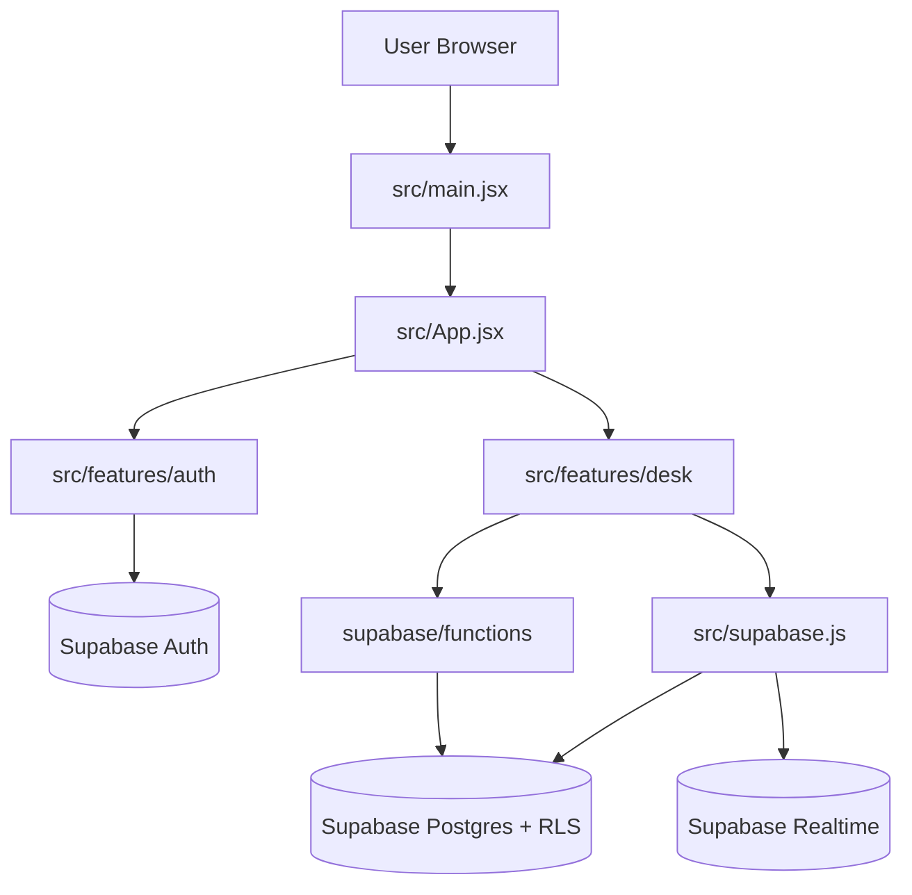

# DoodleDesk

DoodleDesk is a collaborative visual workspace built with React + Vite and backed by Supabase.
It lets users create desks, place notes/checklists/decorations on a freeform canvas, collaborate with friends, and keep lightweight activity history.

This README is intended for two audiences:
1. New users and contributors who need to run and modify the app.
2. Engineers reviewing the codebase who need a quick architecture and data-flow map.

## What the app does

Core capabilities:
- Email/password auth with session recovery flow.
- Multi-desk workspace with shelf organization.
- Freeform desk canvas with sticky notes, checklists, and decorative items.
- Drag/resize/rotate interactions with optional snap-to-grid.
- Undo/redo and autosave/history synchronization behavior.
- Desk collaboration (membership roles and requests).
- Friend requests and social profile surfaces.
- Activity feed and profile stats.
- Desk import/export and background customization.

## Tech stack

Frontend:
- React 19
- Vite 7
- ESLint 9

Backend/services:
- Supabase Auth
- Supabase Postgres + RLS
- Supabase Realtime
- Supabase Edge Functions (TypeScript)

Project style:
- Feature-first organization under `src/features`.
- Public feature APIs via `src/features/*/index.js` barrel files.
- App-level orchestration in `src/App.jsx`.

## Architecture at a glance

High-level runtime flow:
1. `src/main.jsx` mounts the app and applies iframe/top-window safety behavior.
2. `src/App.jsx` reads auth session state and gates UI via auth boundary.
3. The `Desk` flow composes desk orchestration hooks (state, lifecycle, actions, UI derivations).
4. Data persistence and realtime synchronization are handled through the shared Supabase client in `src/supabase.js`.

Primary feature boundaries:
- `src/features/auth`
  - Login/reset/recovery screens and session hooks.
- `src/features/desk`
  - Canvas UI components, desk actions, data queries, realtime wiring, history, import/export, shelf hierarchy, membership, and social interactions.

Backend boundary:
- `supabase/functions/delete-account`: authenticated account-deletion workflow.
- `supabase/functions/friend-request-email`: friend request email/webhook processing.

## Quick architecture diagram



Read this as:
1. The browser boots through `src/main.jsx` into `src/App.jsx`.
2. App orchestration branches into auth and desk feature boundaries.
3. Both feature flows rely on Supabase services through the shared client and edge-function workflows.

## Repository map

- `src/App.jsx`: top-level app and desk orchestration composition.
- `src/main.jsx`: React root entrypoint.
- `src/supabase.js`: shared Supabase client and required frontend env validation.
- `src/features/auth`: auth hooks and auth screens/components.
- `src/features/desk`: desk domain implementation (components, hooks, constants, utils, data).
- `supabase/functions`: edge functions used by production workflows.
- `BACKEND_SQL_README.md`: canonical SQL migration and security hardening source.
- `docs/PROJECT_ORGANIZATION.md`: maintainability conventions and decomposition guidance.
- `new changes.md`: running changelog.

## Local development setup

### Prerequisites

- Node.js 20+ recommended.
- npm 10+ recommended.
- A Supabase project with Auth/Postgres enabled.

### 1) Install dependencies

```bash
npm install
```

### 2) Configure environment variables

Create a `.env` file in the project root with:

```bash
VITE_SUPABASE_URL=your_supabase_project_url
VITE_SUPABASE_ANON_KEY=your_supabase_anon_key
VITE_ENABLE_FINAL_PROJECT=false
```

The app will throw a startup error if either value is missing (enforced in `src/supabase.js`).
Set `VITE_ENABLE_FINAL_PROJECT=true` to show the DoodleDesk Analytics submission shell instead of the desk app.

### 3) Run the app

```bash
npm run dev
```

Open the local URL printed by Vite (commonly `http://localhost:5173`).

### 4) Validate quality gates

```bash
npm run lint
npm run build
```

## NPM scripts

- `npm run dev`: start Vite dev server.
- `npm run build`: create production build.
- `npm run preview`: preview production build locally.
- `npm run lint`: run ESLint across the project.

## Backend and database setup

Run SQL migrations from:
- `BACKEND_SQL_README.md` (source of truth; run sections in order)

Important backend entities managed there:
- Core tables for profiles, desks, notes, checklists, checklist items, decorations, memberships, friend requests, and shelf organization.
- Index creation.
- Realtime publication membership.
- RLS enablement and policy guidance.
- Security hardening steps (including forced RLS and defensive constraints).

Recommended workflow:
1. Apply migration sections in order from `BACKEND_SQL_README.md`.
2. Confirm tables/policies/publication state in Supabase SQL editor.
3. Test end-to-end app flows locally.

### Security hardening checklist (before production)

- [ ] Run all SQL sections from `BACKEND_SQL_README.md` Section 12
- [ ] Enable "Havebeenpwned" password checks in Supabase Auth settings
- [ ] Verify all RLS policies are in place with `select tablename from pg_tables where schemaname='public'`
- [ ] Check that realtime publication is configured for all required tables
- [ ] Test that viewers cannot edit desks or items
- [ ] Test that users cannot access other users' private desks
- [ ] Rotate any shared secrets (webhook credentials, etc.) used in production
- [ ] Review `SECURITY.md` for vulnerability reporting process

## Edge function configuration (production)

Set these Supabase Edge Function environment variables:

- `ALLOWED_ORIGINS`: comma-separated allowed browser origins.
- `APP_BASE_URL`: canonical app URL for links and origin fallback checks.
- `FRIEND_REQUEST_WEBHOOK_SECRET`: shared secret for `friend-request-email` webhook validation.
- `FRIEND_REQUEST_FROM_EMAIL`: sender email identity.
- `RESEND_API_KEY`: provider API key for outbound email.

Security reminders:
- Never expose `SUPABASE_SERVICE_ROLE_KEY` in frontend code.
- Keep only anon credentials in Vite client env variables.
- Enable leaked password protection in Supabase Auth settings.

## Collaboration and authorization model

At a high level:
- Desk owners create and manage desks.
- Members can be granted roles (owner/editor/viewer behavior is enforced by app logic + backend policies).
- Viewers are read-only for desk item modifications.
- Friend requests and desk member requests are modeled separately.

Data safety depends on both layers:
- Frontend gating to keep UX coherent.
- Backend RLS/policies to enforce actual data security.

## Codebase analysis guide

If you are auditing or extending the codebase, start here:
1. `src/App.jsx` to see orchestration boundaries and integration points.
2. `src/features/desk/index.js` to understand the desk feature public surface.
3. `src/features/auth/index.js` for auth module boundaries.
4. `src/supabase.js` for client initialization and required env contract.
5. `docs/PROJECT_ORGANIZATION.md` for maintainability conventions and decomposition strategy.
6. `BACKEND_SQL_README.md` for schema, policies, and security migration history.

## Troubleshooting

### App fails on startup with missing env variables

Cause:
- `VITE_SUPABASE_URL` or `VITE_SUPABASE_ANON_KEY` is not set.

Fix:
- Add both variables to `.env` and restart `npm run dev`.

### Lint/build passes but local dev server seems unavailable

Potential causes:
- Another local Vite process already occupies the expected port.
- Terminal exited before noticing the actual assigned fallback port.

Fix:
1. Restart dev server with `npm run dev`.
2. Use the exact URL Vite prints in terminal output.
3. Stop stale local Vite/node processes if multiple are running.

### Supabase auth/data requests fail at runtime

Check:
- Supabase URL/key values in `.env`.
- Required SQL sections applied from `BACKEND_SQL_README.md`.
- RLS policies and realtime publication were applied successfully.

## Documentation map

- `README.md`: onboarding, architecture, and development workflows.
- `BACKEND_SQL_README.md`: backend SQL and security migration source.
- `docs/PROJECT_ORGANIZATION.md`: maintainability and module-organization practices.
- `new changes.md`: chronological project change log.

## Maintenance expectations

When shipping changes:
1. Keep feature boundaries intact (`auth` vs `desk`).
2. Prefer hook/component extraction instead of growing `App.jsx` inline complexity.
3. Run `npm run lint` and `npm run build` before finalizing.
4. Update docs/changelog files when behavior, architecture, or setup expectations change.
